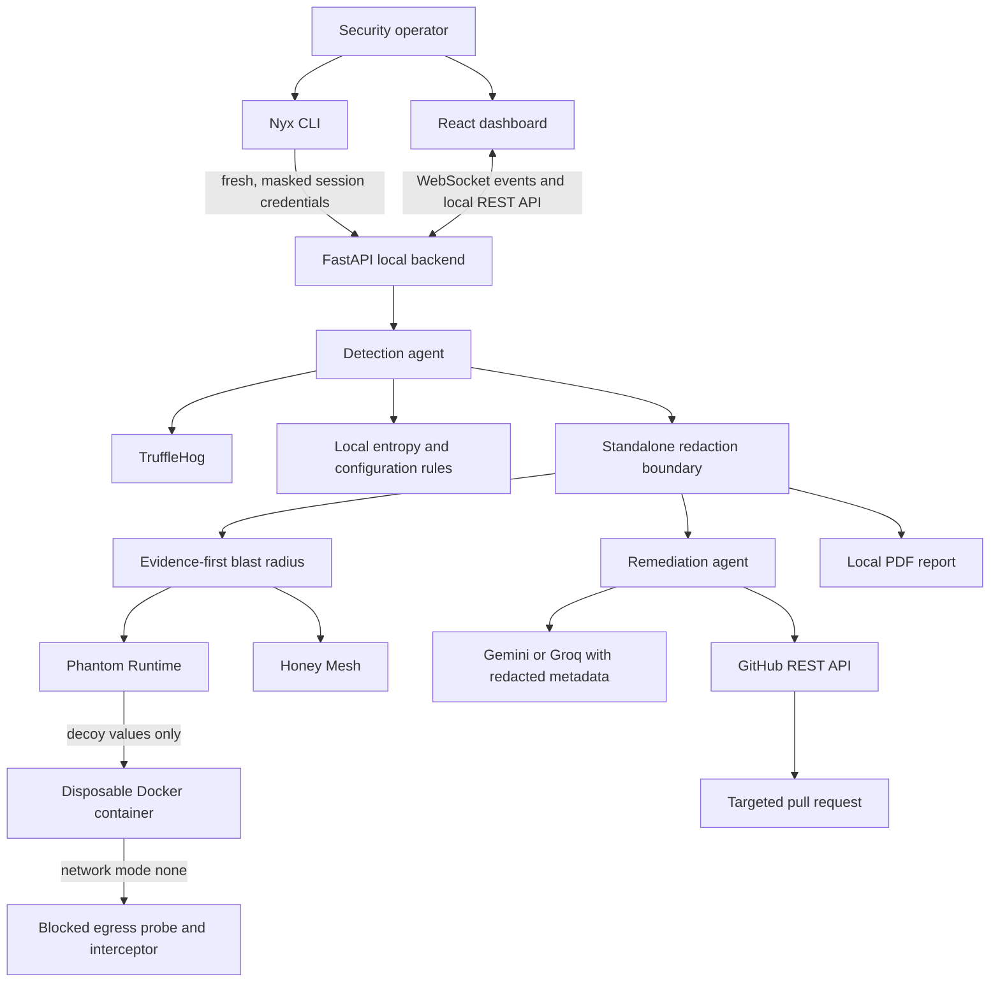

# Nyx

Nyx is a local-first credential containment platform for discovering exposed credentials, mapping their code impact, testing a decoy-substituted execution path, deploying honeytokens, and preparing narrowly scoped remediation pull requests.

Nyx is designed for a security review workflow in which sensitive values stay on the operator's machine. The dashboard receives redacted findings only, LLM providers receive redacted metadata only, and GitHub credentials are supplied per session rather than written to disk.

## Capabilities

- Detect credentials with TruffleHog and a supplementary local entropy and configuration pass.
- Redact findings before they reach the browser, report generator, WebSocket stream, or LLM transport.
- Build an evidence-backed blast-radius graph from the repository currently being scanned.
- Execute a discovered Python path in a disposable Docker container with decoy credentials and no network access.
- Generate honeytokens for detected credential classes and clearly label attacker interaction as a simulation.
- Create a narrowly scoped GitHub pull request only after validating a personal access token against the target repository's real write permissions.
- Keep phase progression under operator control. Each completed phase waits for an explicit Proceed action.

## Architecture



## Repository layout

```text
backend/                 FastAPI service, scan agents, redaction, tests, PDF output
backend/agents/          Detection, blast radius, Phantom, Honey Mesh, remediation
backend/redaction/       Standalone credential redaction boundary
cli/                     Interactive Node.js CLI and session-key collection
dashboard/               React and Vite operator dashboard
start.ps1                Windows quick-start script for the dashboard and backend
context.md               Implementation decisions and current verification state
```

## Prerequisites

- Python 3.11 or later
- Node.js 20 or later
- Git
- TruffleHog installed locally and available on `PATH`, or its absolute binary path
- Docker Desktop running for Phantom Runtime
- A Gemini API key and a Groq API key for LLM-assisted remediation content
- A GitHub personal access token when using Auto-PR

For Auto-PR, use either of these token configurations for the target repository:

- Classic personal access token with `repo` scope.
- Fine-grained personal access token with repository access, Contents set to Read and write, Pull requests set to Read and write, and Metadata set to Read-only.

## Quick start

### 1. Clone and install dependencies

```powershell
git clone https://github.com/HelloItsJustin/Nyx.git
cd Nyx

python -m venv .venv
.\.venv\Scripts\Activate.ps1
python -m pip install -r backend\requirements.txt

Push-Location dashboard
npm ci
Pop-Location

Push-Location cli
npm ci
Pop-Location
```

### 2. Configure non-secret defaults

Copy `.env.example` to `.env` and update paths or the Auto-PR target if needed. Do not put a GitHub personal access token in this file. Nyx collects and validates that token for each CLI session.

```powershell
Copy-Item .env.example .env
```

### 3. Start Nyx

Use the CLI for the complete, session-based credential flow:

```powershell
Push-Location cli
npm start
```

The CLI prompts for each required key, masks key input, validates the GitHub token against the configured target repository, starts the local FastAPI process, and opens the dashboard.

For a dashboard-only local run, use the quick-start script after setting any required non-secret configuration:

```powershell
.\start.ps1
```

The backend binds to `127.0.0.1` by default. Open `http://127.0.0.1:8000` if the browser does not open automatically.

## Configuration

| Variable | Purpose | Default |
| --- | --- | --- |
| `GOOGLE_GEMINI_API_KEY` | Primary LLM provider for remediation content | Required for LLM generation |
| `GROQ_API_KEY` | Fallback LLM provider | Required for LLM fallback |
| `TRUFFLEHOG_BINARY_PATH` | TruffleHog executable path | `trufflehog` |
| `GITHUB_TARGET_OWNER` | Auto-PR target owner | `HelloItsJustin` |
| `GITHUB_TARGET_REPO` | Auto-PR target repository | `FinForge` |
| `DOCKER_BINARY_PATH` | Docker executable path | Docker on `PATH` |
| `SANDBOX_NETWORK_MODE` | Docker network mode for Phantom Runtime | `none` |
| `NYX_PHANTOM_IMAGE` | Phantom Runtime container image | `python:3.12-slim` |
| `NYX_PHANTOM_TIMEOUT_SECONDS` | Per-sandbox timeout in seconds | `30` |
| `NYX_PORT` | Backend listen port | `8000` |

`GITHUB_ACCESS_TOKEN` is an in-memory session variable set only after a successful validation. It should not be added to `.env`, committed, logged, or exposed by the dashboard.

## Operator workflow

1. Start Nyx and enter the requested session keys.
2. Validate the GitHub personal access token if Auto-PR will be used.
3. Scan a GitHub repository URL or upload a repository archive.
4. Review findings with masked credential previews.
5. Click Proceed to advance each completed phase. Nyx never advances to another agent automatically.
6. Inspect the blast-radius graph and its file and line evidence.
7. Review Phantom Runtime events. The run uses a disposable copy, substitutes same-shape decoys, verifies outbound networking is blocked, and removes its container.
8. Review generated remediations. Select Auto-PR only after confirming the exact proposed change.
9. Open the returned GitHub pull request URL and review it before merging.

## Security model

### Redaction boundary

The redaction module is local and independent of AI providers. It replaces known secret values, applies an entropy-based fallback for secret-shaped assignments, and blocks a provider request when a credential-shaped value survives sanitization. The frontend, WebSocket events, and report generator operate on redacted copies.

### GitHub authorization

Nyx supports classic and fine-grained personal access tokens. It determines Auto-PR authorization by calling `GET /repos/{owner}/{repo}` and requiring `permissions.push` in the response. It does not use the `X-OAuth-Scopes` response header as an authorization gate because GitHub does not return that header for fine-grained tokens.

The Auto-PR path reads the default branch, verifies the exact scanned source line, creates a branch, commits only the targeted file, and opens the pull request through the GitHub REST API. It waits for the actual API response before presenting a clickable pull request URL.

### Phantom Runtime isolation

Phantom Runtime refuses to execute unless `SANDBOX_NETWORK_MODE=none`. It builds a disposable repository copy, replaces findings with same-shape decoys, verifies a direct outbound connection is blocked, intercepts Python socket connection attempts for the terminal stream, imposes a timeout, and confirms that the Docker running-container count returns to its original value.

The Phantom container exists only for the duration of one analysis. It has no path to the host source repository and no outbound Docker network.

### Honey Mesh behavior

Honeytoken generation and placement logic are real local operations. The attacker interaction shown for demonstration is explicitly simulated. Nyx does not claim that a live attacker was observed when one was not.

## Development and verification

Run backend tests:

```powershell
Push-Location backend
python -m unittest discover -s tests -v
Pop-Location
```

Build the dashboard:

```powershell
Push-Location dashboard
npm run build
Pop-Location
```

Run the backend during development:

```powershell
Push-Location backend
python -m uvicorn main:app --host 127.0.0.1 --port 8000 --reload
```

If port 8000 is unavailable, either stop the process using it or select a different `NYX_PORT` when starting Nyx through the CLI.

## Troubleshooting

### GitHub token is accepted in the CLI but unavailable in the dashboard

Start the backend through `npm start` in `cli` so it inherits the validated session token. If the backend was started separately with `uvicorn`, validate the token in the dashboard's Remediation panel for that backend process.

### Auto-PR cannot generate PR metadata through an LLM provider

Nyx first attempts formal PR metadata generation through Gemini or Groq using redacted metadata. If neither provider is reachable, it generates the same formal Summary, Changes, and Verification structure locally from redacted finding fields. The exact-line verification and GitHub API checks remain mandatory.

### Docker is unavailable

Start Docker Desktop and confirm that `docker version` can reach the server from the same user account. Configure `DOCKER_BINARY_PATH` when Docker is not on `PATH`. Phantom Runtime returns a visible sandbox error instead of showing a simulated terminal trace.

## Contribution guidelines

- Never commit `.env`, tokens, generated reports, dependency directories, or build output.
- Preserve the redaction boundary before adding UI, reporting, or provider integrations.
- Keep Auto-PR changes narrowly scoped to exact validated source lines.
- Add or update tests for security-sensitive behavior.
- Keep operator-facing claims precise about what was executed live and what was simulated.

## Current project status

The project contains backend verification for redaction, GitHub token permission handling, blast-radius evidence integrity, Phantom support shims, and remediation metadata fallback. See `context.md` for detailed implementation and verification notes.
